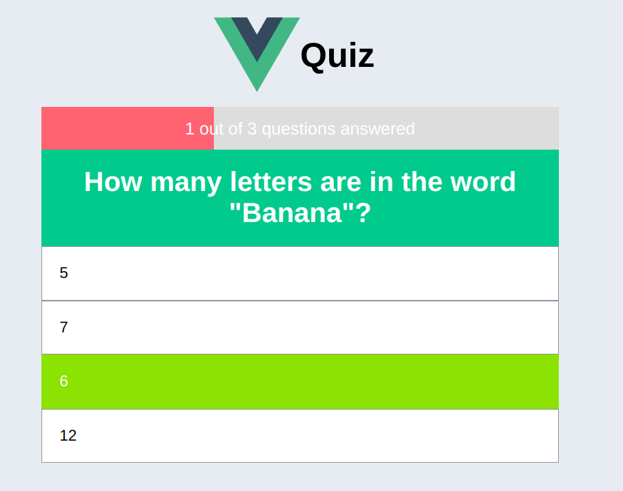

# vue-quiz
[](https://app.netlify.com/sites/super-cool-site-by-smissaertj/deploys)

A simple quiz built with Vue.js and Vite.



[**Demo**](https://super-cool-site-by-smissaertj.netlify.app/)  


## Local Setup

```sh
npm install
```

### Compile and Hot-Reload for Development

```sh
npm run dev
```

### Compile and preview
```sh
npm run preview
```

### Compile and Minify for Production

```sh
npm run build
```
